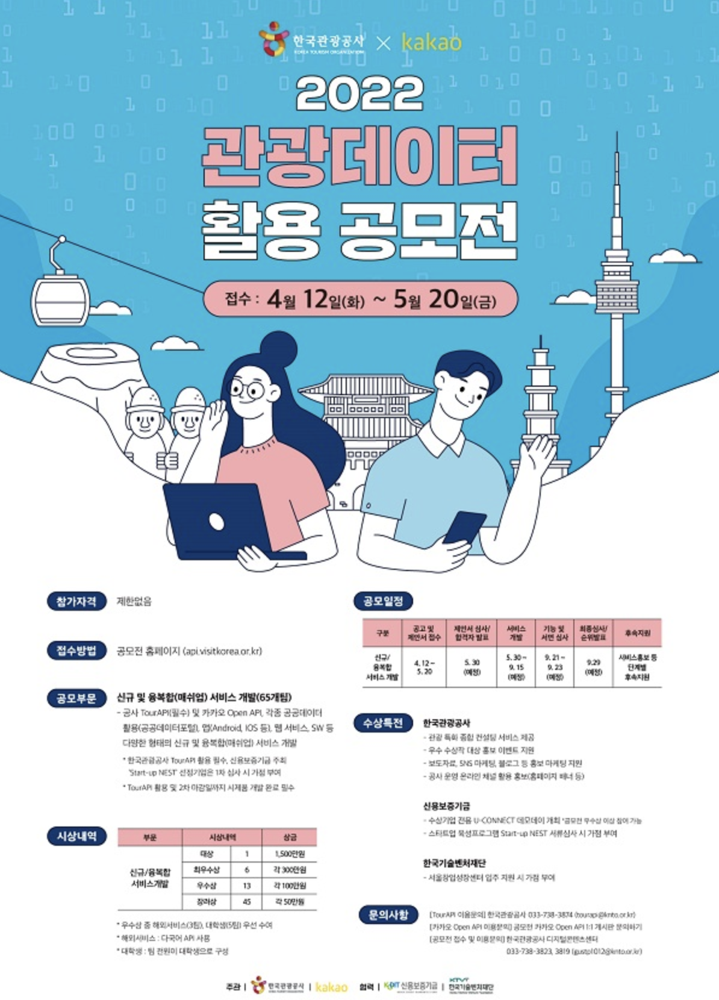
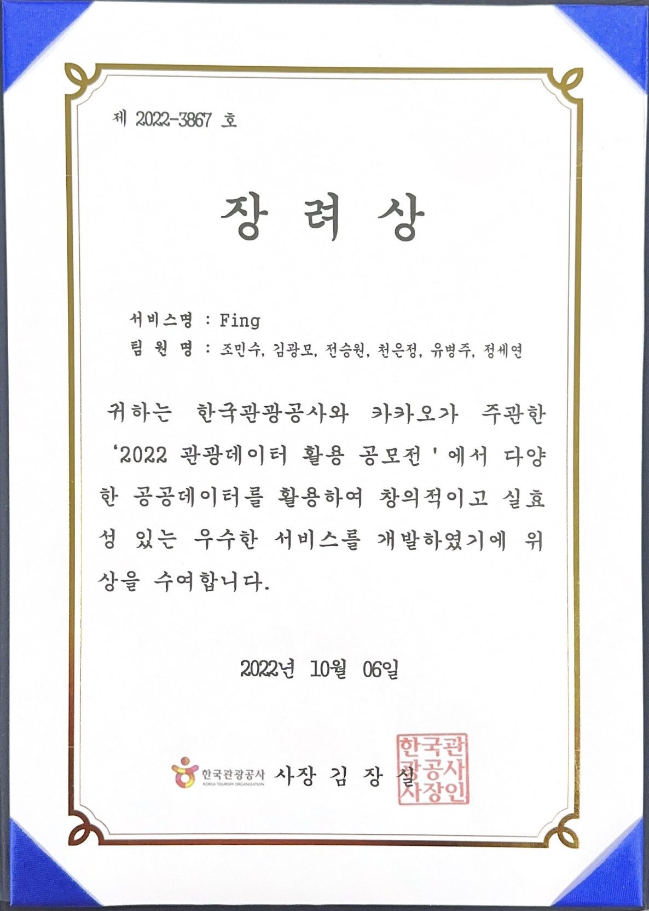

# Fing(Festival -ing)
2022년 관광데이터 활용 공모전 Tour API 4.0

[✨ 웹페이지 바로가기 ✨](http://www.festival-ing.com)

[✨ 어플리케이션 바로가기 ✨](https://www.festival-ing.org/#/)

[✨ 수상내역 확인 바로가기 ✨](https://www.festival-ing.org/#/](https://api.visitkorea.or.kr/#/cntBoardDetail?no=2))

 

## 🖥 프로젝트 소개
"Fing(Festival-ing)"은 한국관광공사의 Open API를 사용하여 축제와 관련한 다양한 정보를 제공하는 Flutter기반의 어플리케이션이다.

페스티벌의 상세 정보와, 페스티벌 개최지 주위 식당∙카페∙숙박∙맛집 정보를 추가로 제공하여 사용자의 편의성을 증가한다.

 

## 👩🏻‍💻 멤버 구성

| [조민수](https://github.com/lookinmin)    |   [김광모](https://github.com/kkm0406)    | [유병주](https://github.com/youbj) | [전승원](https://github.com/s2eung1) | [정세연](https://github.com/seyeonJeong) | [천은정](https://github.com/ezzanzzan) |
| :-------: | :-------: | :-------: | :-------: | :-------: | :-------: |
| ![조민수] | ![김광모] | ![유병주] | ![전승원] | ![정세연] | ![천은정] |

 
 
## 👩🏻‍💻 프로젝트 개요/동기
페스티벌이 개최되는 지역의 관광의 발전을 유도하고 외부 인구의 유입을 늘려 경제가 활성화되고 지역산업의 발전을 불러오는 긍정적인 파급 효과를 불러일으킬 수 있는데 힘을 쓰고자 한다.

 

## ⚒️ 기술 스택
### Mobile Application
- Front-End : Flutter
- DataBase : Firebase
- API : KaKao API, Tour API 4.0, Google API, Korean Traditional Market API
- Development Environment : VS Code, Firebase
- Language : Dart

### Web Application
- Front-End : React, Flutter
- Development Environment : VS Code
- Language : Javascript, Typescript, Dart

 

## 🌈 구현 기능

### 메인 페이지
![main]

### Fing Market, 지역 페이지
![market]

### 지역리스트, 페스티벌 상세 페이지
![fing1]

### 찜 페이지, 마이페이지
![fing2]

### Web
![web]

 

## 🏆 수상 내역

  
  
   

<!-- Image Refernces -->
[조민수]: /img/%E1%84%8C%E1%85%A9%E1%84%86%E1%85%B5%E1%86%AB%E1%84%89%E1%85%AE.png
[김광모]: /img/%E1%84%80%E1%85%B5%E1%86%B7%E1%84%80%E1%85%AA%E1%86%BC%E1%84%86%E1%85%A9.png
[유병주]: /img/%E1%84%8B%E1%85%B2%E1%84%87%E1%85%A7%E1%86%BC%E1%84%8C%E1%85%AE.png
[정세연]: /img/%E1%84%8C%E1%85%A5%E1%86%BC%E1%84%89%E1%85%A6%E1%84%8B%E1%85%A7%E1%86%AB.png
[전승원]: /img/%E1%84%8C%E1%85%A5%E1%86%AB%E1%84%89%E1%85%B3%E1%86%BC%E1%84%8B%E1%85%AF%E1%86%AB.png
[천은정]: /img/%E1%84%8E%E1%85%A5%E1%86%AB%E1%84%8B%E1%85%B3%E1%86%AB%E1%84%8C%E1%85%A5%E1%86%BC.png
[fing1]: /img/fing-00.gif
[fing2]: /img/fing-11.gif
[web]: /img/fing-web.gif
[main]: /img/%E1%84%86%E1%85%A6%E1%84%8B%E1%85%B5%E1%86%AB%E1%84%91%E1%85%A6%E1%84%8B%E1%85%B5%E1%84%8C%E1%85%B5(1).gif
[market]: /img/%E1%84%86%E1%85%A1%E1%84%8F%E1%85%A6%E1%86%BA%2C%E1%84%8C%E1%85%B5%E1%84%8B%E1%85%A7%E1%86%A8(2).gif
[fing3]: /img/222.gif
[포스터]: /img/poster.png
[상장]: /img/award.png
